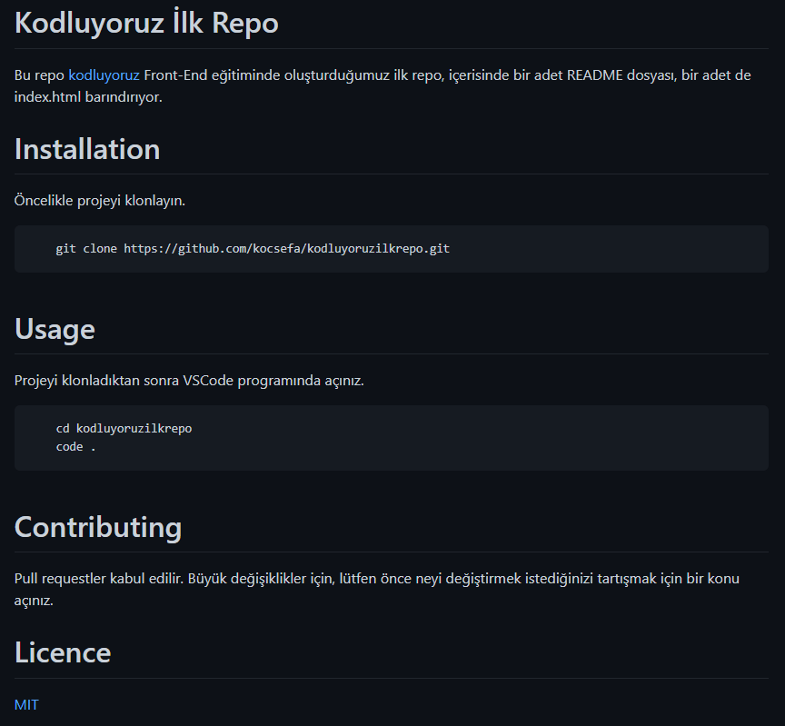

# **Kodluyoruz İlk Repo**
Bu repo [kodluyoruz](https://app.patika.dev/courses/git/odev1) Front-End eğitiminde oluşturduğumuz ilk repo, içerisinde bir adet README dosyası, bir adet de index.html barındırıyor.

# **Installation**
Öncelikle projeyi klonlayın.

        git clone https://github.com/kocsefa/kodluyoruzilkrepo.git

# **Usage**
Projeyi klonladıktan sonra VSCode programında açınız.

        cd kodluyoruzilkrepo
        code .

# **Contributing**
Pull requestler kabul edilir. Büyük değişiklikler için, lütfen önce neyi değiştirmek istediğinizi tartışmak için bir konu açınız.

# **Licence**

[MIT](./LICENSE)